# 🛡️ FraudGuard - Financial Fraud Detection System

> **A comprehensive Risk Management System designed to detect anomalous financial transactions in real-time using Statistical Models and a Strategy-based Rule Engine.**


## 📖 Overview

**FraudGuard** simulates a middleware security layer between a Core Banking System and Transaction Processing Units. It analyzes transactions in real-time to block fraudulent activities based on:
1.  **Deterministic Rules:** Blacklist checks, Velocity limits (frequency), and Threshold limits.
2.  **Statistical Analysis:** Advanced **Z-score** and **IQR (Interquartile Range)** algorithms to identify behavioral outliers.

The system features a **Simulation Client (E-Banking)** for generating traffic and an **Admin Portal** for monitoring alerts and managing rules.

---

## 🏗️ Technical Architecture

### 1. Strategy Design Pattern (Backend Core)
The core logic utilizes the **Strategy Pattern** to decouple validation rules. This ensures the system adheres to the **Open/Closed Principle**—new fraud rules can be added without modifying the existing `RuleEngine`.

* **Interface:** `FraudRule` defines the contract.
* **Concrete Strategies:** `VelocityRule`, `HardLimitRule`, `BlacklistRule` implement specific logic.
* **Context:** `RuleEngine` aggregates and executes these rules.

*(Note: See `src/main/java/.../service/rule` for implementation details)*

### 2. Database Schema
A normalized database design separates **Transactional Data** from **Analytical Results**, optimized with Indexing for high-performance history lookups.

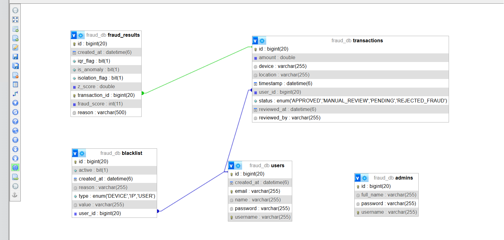

---

## 📸 System Screenshots

### 🛡️ Admin Portal (The Command Center)

**1. Authentication & Dashboard**
Secure login for Administrators and Real-time monitoring of transaction flows.
| **Admin Login** | **Dashboard Overview** |
|:---:|:---:|
| 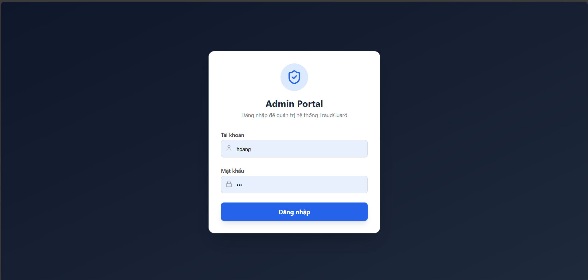 | 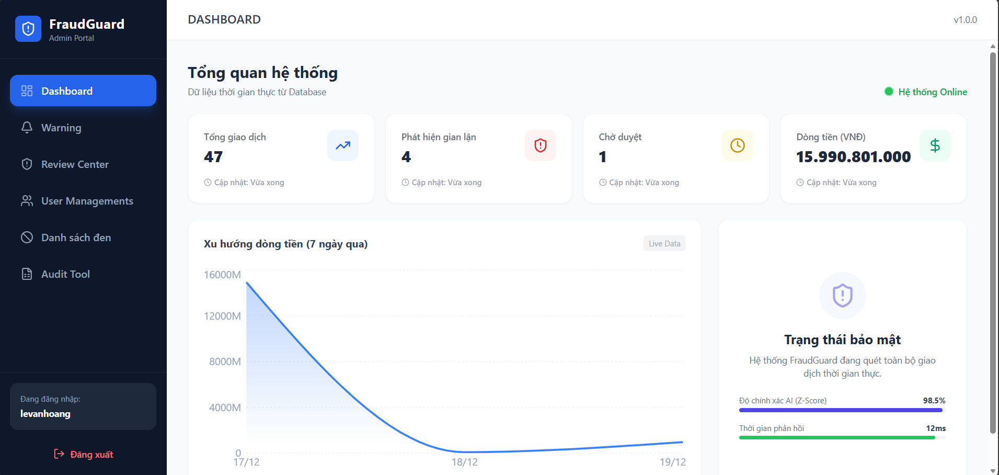 |

**2. Real-time Warnings & Review Center**
Suspicious transactions are flagged instantly. High-risk transactions require manual approval.
| **Warning List** | **Review Center** |
|:---:|:---:|
| 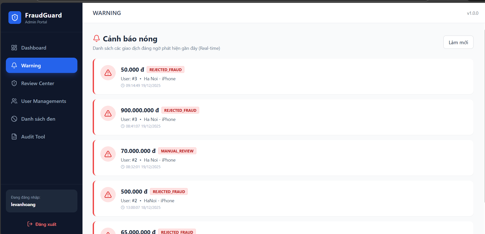 | 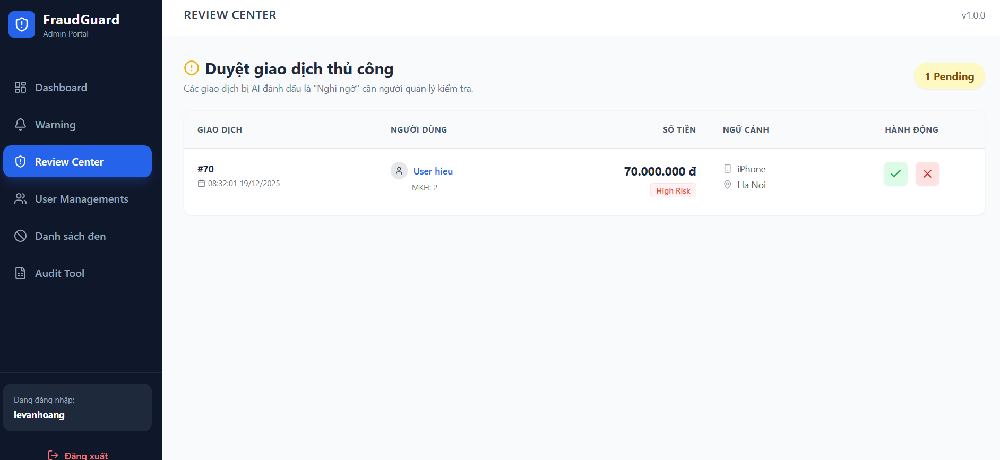 |

**3. Management Modules**
Admins can manage Blacklists (IP, User, Device) and monitor User statuses.
| **Blacklist Manager** | **User Management** |
|:---:|:---:|
| 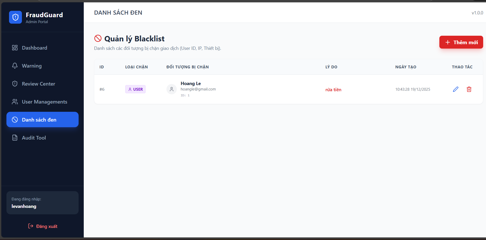 | 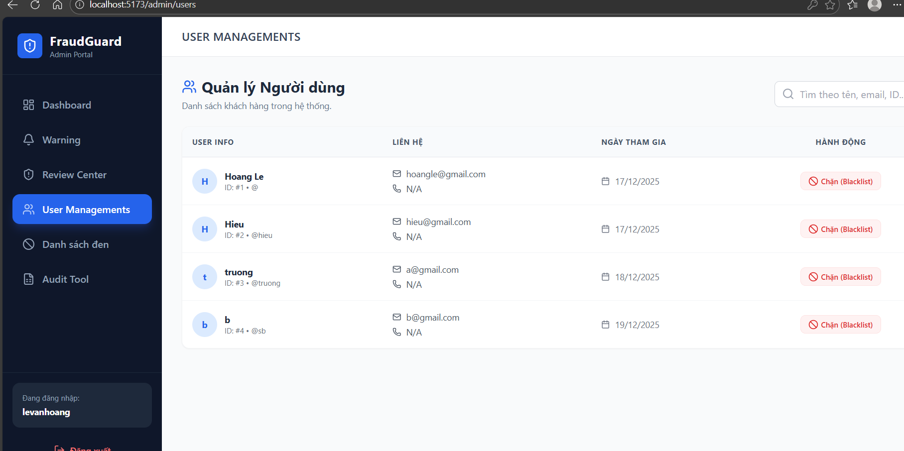 |

**4. Audit Tool**
A specialized tool for auditors to upload CSV logs for retrospective fraud scanning.
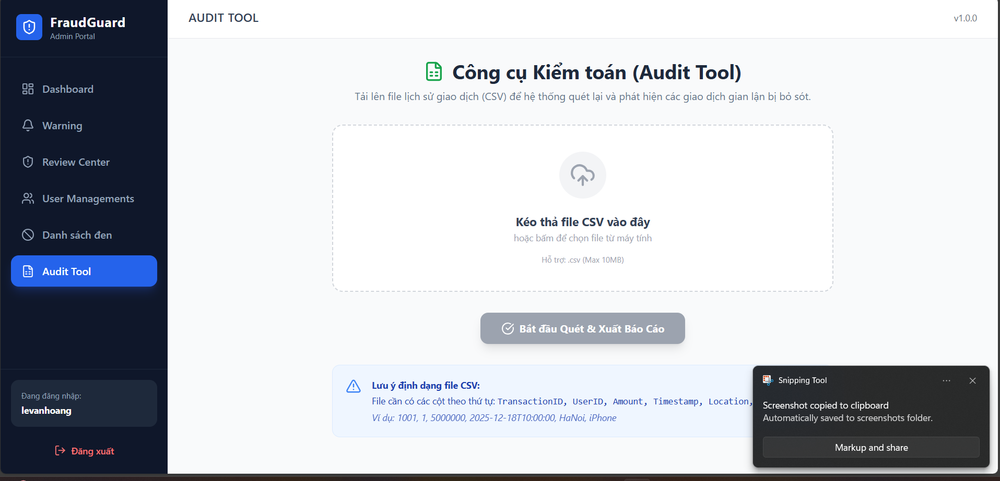

---

### 💳 E-Banking Simulation (The Client)

A simulated environment to test transaction flows and verify blocking mechanisms.

**1. Login & Transfer Interface**
Users log in to perform transactions. Fraudulent attempts (e.g., blacklisted device) trigger immediate blocks.
| **User Login** | **Transfer & Block** |
|:---:|:---:|
| 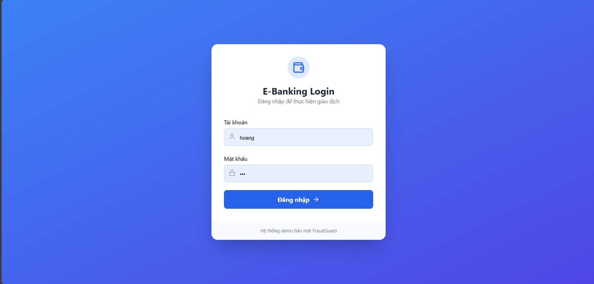 | 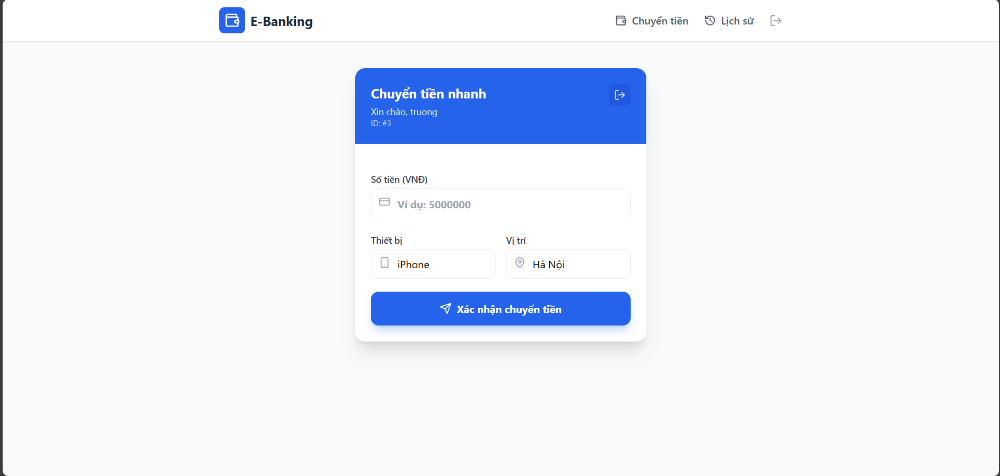 |

**2. Transaction History**
Users can view the status of their transactions (Success vs. Blocked).
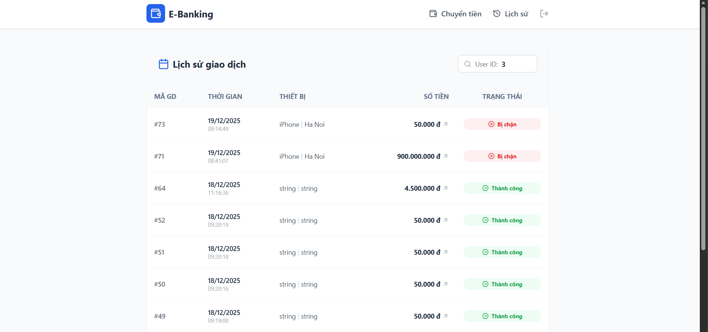

---

## 🛠️ Tech Stack

### Backend (`/fraud-detection`)
* **Language:** Java 17
* **Framework:** Spring Boot 3.x
* **Data:** Spring Data JPA, Hibernate
* **Database:** MySQL 8.0
* **Architecture:** Layered Architecture, Strategy Pattern

### Frontend (`/fraud-detection-frontend`)
* **Framework:** ReactJS (Vite)
* **Styling:** TailwindCSS
* **HTTP Client:** Axios
* **Charts:** Recharts

---

## 🚀 How to Run

### Prerequisites
* **Java JDK 17+**
* **MySQL Server** (Running on localhost:3306)
* **Node.js** (v18 or higher)
* **IDEs:** IntelliJ IDEA (Recommended for Backend) & VS Code (Recommended for Frontend)

---

### Step 1: Database Setup
1.  Open your MySQL Workbench or Client.
2.  Create a new database named `fraud_db`.
    ```sql
    CREATE DATABASE fraud_db;
    ```

### Step 2: Backend Setup (IntelliJ IDEA)
1.  Open **IntelliJ IDEA**.
2.  Go to **File > Open** and select the folder **`fraud-detection`** (inside the root directory).
3.  Wait for Maven to sync dependencies.
4.  Open `src/main/resources/application.properties` and update your database credentials:
    ```properties
    spring.datasource.username=root
    spring.datasource.password=YOUR_PASSWORD
    ```
5.  Locate the main class `FraudDetectionApplication.java` and click the **Run (▶)** button.
6.  The Backend API will start at: `http://localhost:8080`.

### Step 3: Frontend Setup (VS Code)
1.  Open **Visual Studio Code**.
2.  Go to **File > Open Folder** and select the folder **`fraud-detection-frontend`**.
3.  Open a Terminal in VS Code (**Ctrl + `**).
4.  Install dependencies (run once):
    ```bash
    npm install
    ```
5.  Start the development server:
    ```bash
    npm run dev
    ```
6.  Click the link shown in the terminal (usually `http://localhost:5173`) to open the application.

---

## 👤 Author

**LE VAN HOANG**
* **Role:** Backend Developer
* **Email:** hoanglv1106@gmail.com
* **Location:** Ha Noi, Vietnam

> *This project is a personal research implementation focusing on Backend Engineering, System Design, and Financial Security.*